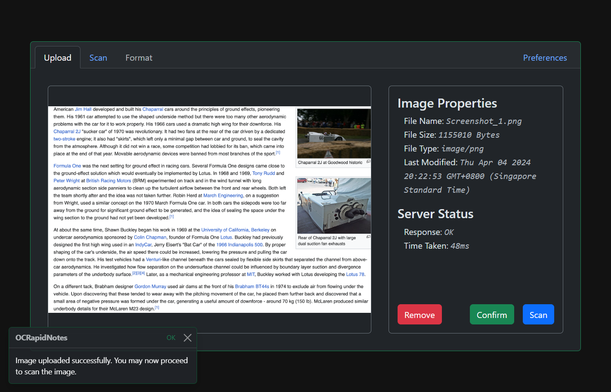
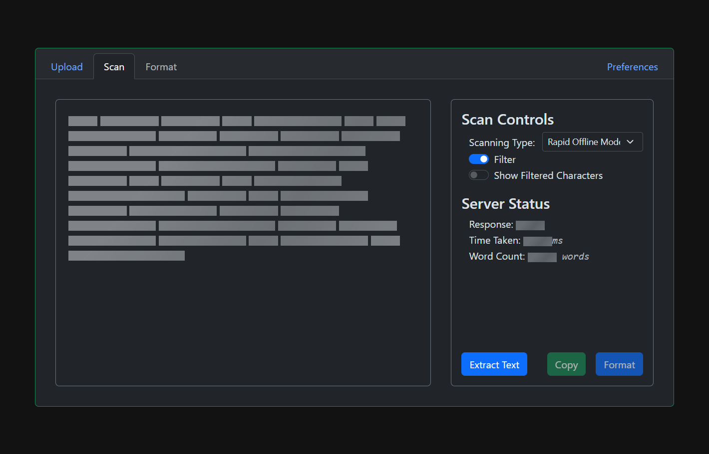
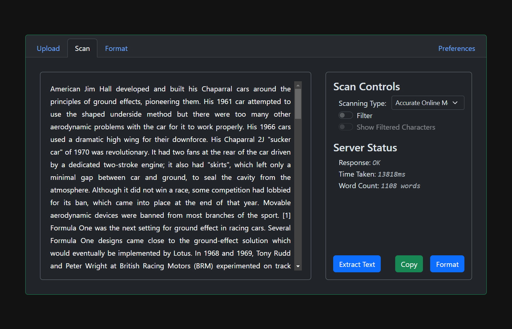
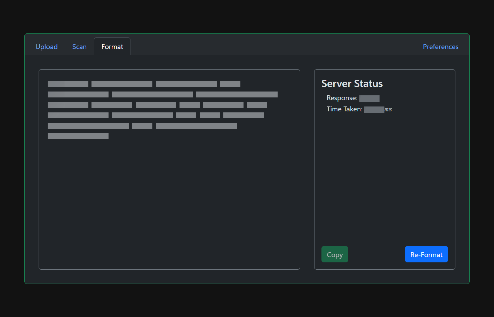
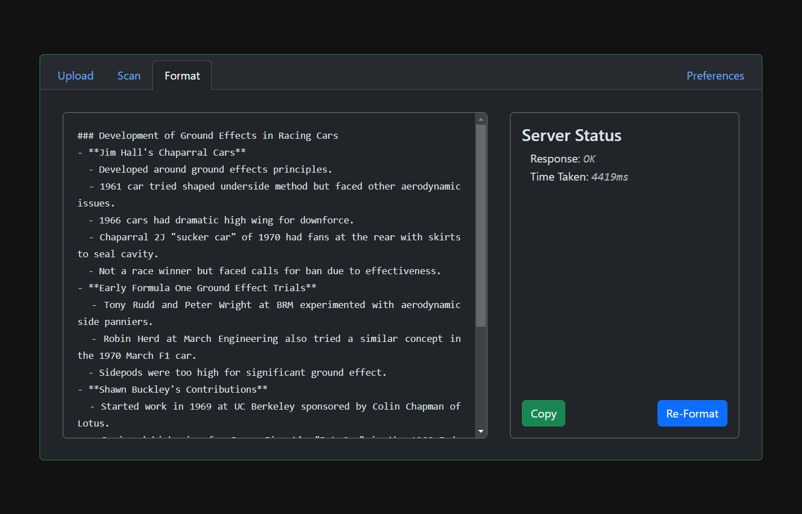
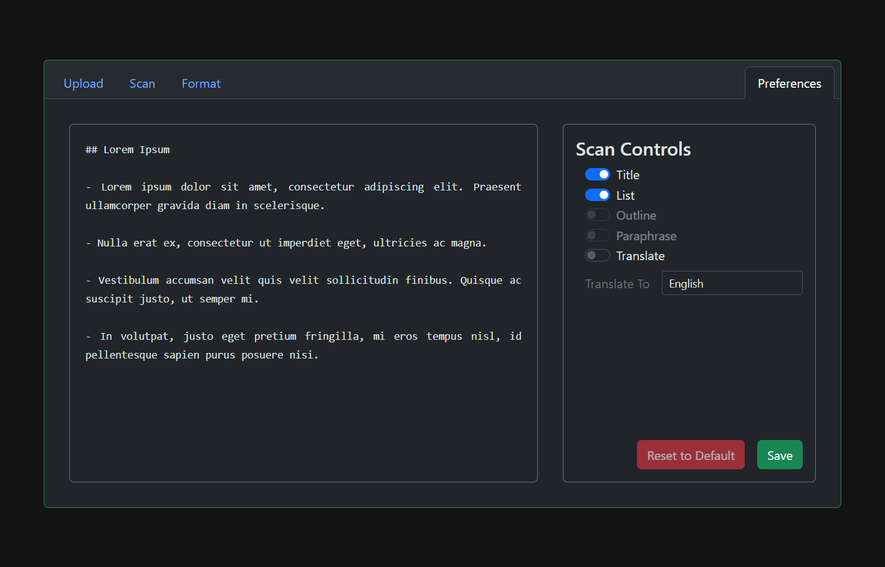

# OCRapidNotes

This application provides a way to interface the following Optical Character Recognition (OCR) models:

1. [Tesseract](https://www.npmjs.com/package/tesseract.js) - A javascript library that gets words in almost any language out of images.
2. [Google Vision API](https://cloud.google.com/vision?hl=en) - A readily available API (REST and RPC) that allows developers to easily integrate common vision detection features within applications, including image labeling, face and landmark detection, optical character recognition (OCR), and tagging of explicit content.
3. [PaddleOCR](https://github.com/PaddlePaddle/PaddleOCR) - Aims to create multilingual, awesome, leading, and practical OCR tools that help users train better models and apply them into practice.

## Project Status

Currently, this project is still unfinished and is a work-in-progress build. As of now, this project is able to upload, scan, and format notes using only 2 out of the 3 OCR models (Tesseract & Google Vision API).

## Project Tasks

The following are things that are to be implemented in the near future:

### Server-Side

- [x] **PaddleOCR** Implementation
- [x] Server Error Feedback (Special Cases)
- [x] Format Preferences Prompt Handling
- [ ] Handle Multiple Images

### Client-Side

- [x] User <font color="#6ea8fe">**Preference**</font> Tab
- [x] Preferences Functionality
- [ ] .md to .pdf
- [ ] Process Formatted Markdown
- [ ] Scanning & Formatting Progress Bar

### Research

- [x] Extensive <font color="#ffda6a">**Testing**</font>

  - [x] Needs google drive folder for images to test
  - [x] Formatting and analyzation of data

- [x] Finalize Paper

## Installation

To get the code working on a local machine, you must first download the project and extract it. Once you have extracted it, you can navigate to the directory and install all the packages.

```bash
cd ./ocrapidnotes/
npm i
```

or

```bash
cd ./ocrapidnotes/
npm install
```

then, you can install `@google-cloud/vision` using

```bash
npm install @google-cloud/vision
```

to enable PaddleOCR, you also need to follow the [quickstart guide](https://github.com/PaddlePaddle/PaddleOCR/blob/release/2.7/doc/doc_en/quickstart_en.md) or use the following commands to install `paddlepaddle` on your machine

> If you have CUDA 9 or CUDA 10 installed on your machine, please run the following command to install

```bash
python -m pip install paddlepaddle-gpu -i https://pypi.tuna.tsinghua.edu.cn/simple
```

or

> If you have no available GPU on your machine, please run the following command to install the CPU version

```bash
python -m pip install paddlepaddle -i https://pypi.tuna.tsinghua.edu.cn/simple
```

finally, you need to install the PaddleOCR Whl Package

```bash
pip install "paddleocr>=2.0.1" # Recommend to use version 2.0.1+
```

After you have installed **_OCRapidnotes_**, you can run the _client_ and _server_ scripts by using `npm run client` and `npm run server`. In two different terminals, in the same directory as `package.json`, type:

`Terminal 1:`

```bash
npm run server
```

`Terminal 2:`

```bash
npm run client
```

By default, the client is hosted on `port:5500` and the server is hosted on `port:3000`. To access the user interface provided by the client script, you can go to

```bash
localhost:5500/
```

At this point you should see this screen:


In this upload pane, you can upload file that has an image mimetype of `image/*`. For this example, we are uploading a screenshot about the Le Man's 24 hour race.



> [!NOTE]
> It is required for you to confirm your selected image. As this is what lets the server know what image to use.

Clicking `Scan` will allow you to set different scanning controls such as the OCR model, whether you want the output to be filtered, and whether you want to show the filtered characters.



For this image, we decided to use Google Vision API without filtering the output as our research found that filtering scanned texts doesn't really improve the accuracy that much. It only allows for a better copy to clipboard experience.



Clicking `Format` will automatically format the scanned text using GPT. The following image is the loading screen.



And this is the resulting formatted text.



> [!WARNING]
> This software prototype also has the ability to set user preference. They are stored using website cookies so turning them off for this web application will inevitably remove user preferences.



> [!NOTE]
> There are server notifications in the program to automatically inform you of the status of the server. Most server errors now return their appropriate response codes.
