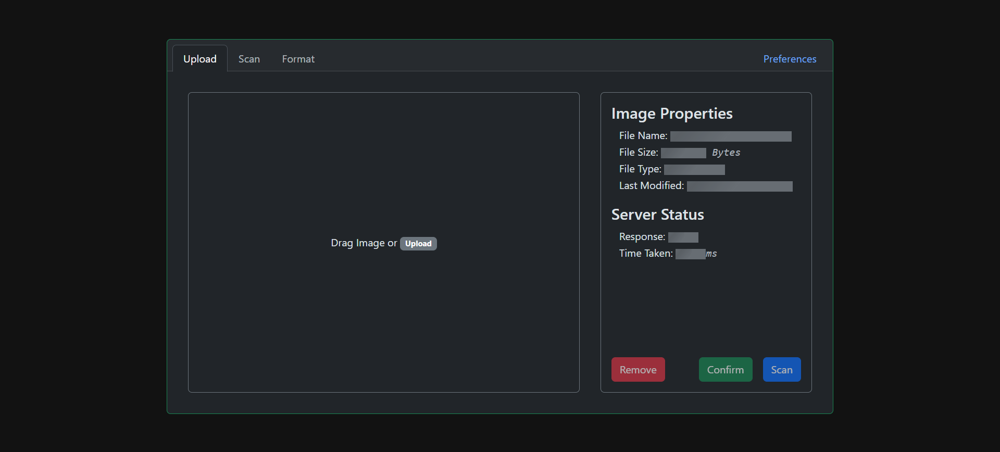

# OCRapidNotes

This application provides a way to interface the following Optical Character Recognition (OCR) models:

1. [Tesseract](https://www.npmjs.com/package/tesseract.js) - A javascript library that gets words in almost any language out of images.
2. [Google Vision API](https://cloud.google.com/vision?hl=en) - A readily available API (REST and RPC) that allows developers to easily integrate common vision detection features within applications, including image labeling, face and landmark detection, optical character recognition (OCR), and tagging of explicit content.
3. [PaddleOCR](https://github.com/PaddlePaddle/PaddleOCR) - Aims to create multilingual, awesome, leading, and practical OCR tools that help users train better models and apply them into practice.

## Project Status

Currently, this project is still unfinished and is a work-in-progress build. As of now, this project is able to upload, scan, and format notes using only 2 out of the 3 OCR models (Tesseract & Google Vision API).

## Project Tasks

The following are things that are to be implemented in the near future:

### Server-Side

- [ ] **PaddleOCR** Implementation
- [ ] Server Error Feedback (Special Cases)

### Client-Side

- [ ] User <font color="#6ea8fe">**Preference**</font> Tab

### Research

- Extensive <font color="#ffda6a">**Testing**</font>
  - [ ] Needs google drive folder for images to test

## Installation

To get the code working on a local machine, you must first download the project and extract it. Once you have extracted it, you can navigate to the directory and install all the packages.

```bash
cd ./ocrapidnotes/
npm i
```

or

```bash
cd ./ocrapidnotes/
npm install
```

After you have installed **_OCRapidnotes_**, you can run the _client_ and _server_ scripts by using `npm run client` and `npm run server`. In two different terminals, in the same directory as `package.json`, type:

`Terminal 1:`

```bash
npm run server
```

`Terminal 2:`

```bash
npm run dev
```

By default, the client is hosted on `port:5500` and the server is hosted on `port:3000`. To access the user interface provided by the client script, you can go to

```bash
localhost:5500/
```

At this point you should see this screen:



> [!NOTE]
> There are server notifications in the program to automatically inform you of the status of the server. However, there are some instances when an error can occur without any indication to the user. This is also another thing to be [fixed](#server-side) in the near future.
